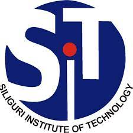
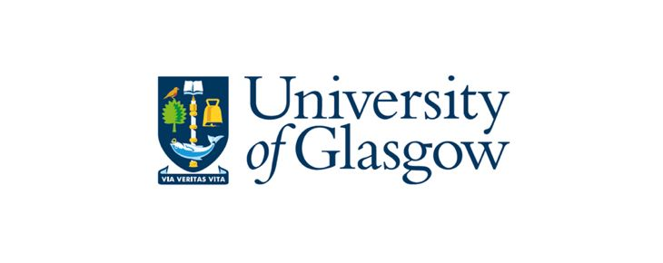

I am currently working as the Principal AI Engineer at <a href="https://www.p360.com/" style="text-decoration: none; color: #4040FF;">P360</a>, building <a href="https://www.p360.com/edenhelp/" style="text-decoration: none; color: #4040FF;">EdenHelp</a>. I joined P360 in February 2018 as a founding data scientist. As an AI Engineer at P360, I have the fortune of working across diverse areas of machine learning and statistical modelling including natural language understanding, large language model, retrieval-augmented generation for conversational AI, time series forecasting and optimization techniques, and predictive modelling within the pharmaceutical sector. My research interest broadly includes <strong>Computer Vision, Vision and Language Modalities, Self-Supervised and Semi-Supervised Learning and Natural Language Understanding.</strong> I also work in deep learning for Medical Image Analysis. Previously, I have worked on document image enhancement.

I completed my Bachelor's (B.Tech) in 2018 in Computer Science and Engineering, where I was the Rank 1 of my department. I was advised by <a href="https://scholar.google.co.in/citations?user=pixVZ0oAAAAJ&hl=en" style="text-decoration: none; color: #4040FF;">Prof. Anupam Mukherjee</a> during my <a href="https://devmesh.intel.com/projects/self-driving-bot-on-intel-architecture#about-section" style="text-decoration: none; color: #4040FF;">Bachelor's Thesis Project</a>. I hold a master's in Data Science and Engineering from the Birla Institute of Technology and Science, Pilani, India. During my master's I worked on multiple research projects on effective and efficient document image enhancement with <a href="https://scholar.google.com/citations?user=1WVrFGwAAAAJ&hl=en" style="text-decoration: none; color: #4040FF;">Prof. Swalpa Kumar Roy</a>, <a href="https://scholar.google.com/citations?user=2_z_CogAAAAJ&hl=en" style="text-decoration: none; color: #4040FF;">Prof. Umapada Pal</a> and <a href="https://scholar.google.com.sg/citations?user=LhSqQCIAAAAJ&hl=en" style="text-decoration: none; color: #4040FF;">Prof. Guang-Bin Huang</a>. I was a Master's Thesis student at <a href="https://www.gla.ac.uk/" style="text-decoration: none; color: #4040FF;">University of Glasgow</a> advised by <a href="https://chaitanya-kaul.github.io/" style="text-decoration: none; color: #4040FF;">Dr. Chaitanya Kaul</a>, and guided by <a href="https://scholar.google.co.in/citations?user=kGLZ1kAAAAAJ&hl=en" style="text-decoration: none; color: #4040FF;">Sankara Nayaki K</a>, working on building an efficient medical imaging model.

Apart from my job and research, I have been actively involved in the community. Since 2018, I have been a part of the <a href="https://devmesh.intel.com/users/risab-biswas" style="text-decoration: none; color: #4040FF;">Intel Innovator's Program</a>. I was recognized as the top innovator in 2019 for my community contributions and research projects. In 2020, I was awarded the first <a href="https://devmesh.intel.com/posts/638312/congrats-to-our-devmesh-spotlight-award-winners" style="text-decoration: none; color: #4040FF;">Intel DevMesh AI Spotlight Award</a>. I have received multiple hardware and monetary grants from Intel under their Early Innovation Challenge to support my research projects. I was also a co-organizer (Feb 2019 - June 2020) in the <a href="https://gdg.community.dev/gdg-siliguri/" style="text-decoration: none; color: #4040FF;">Google Developer Group</a>, Siliguri. 

  

    
    
B.Tech, Computer Science and Engineering, Siliguri Institute of Technology, India Aug. 2014 - Jul. 2018

  

  

    
    
Data Science Intern (Remote), Prescriber360 Solutions, Feb. 2018 - Mar. 2018

  

  

    
    
Principal Engineer AI (Remote), P360, Mar. 2018 - Present

  

  

    
    
M.Tech, Data Science and Engineering, Birla Institute of Technology and Science, India Mar. 2022 - May. 2024

  

  

    
    
Master's Thesis Research Student, University of Glasgow (Logo), UK, Dec. 2023 - Mar. 2024

  

 <strong><em>Note - I am actively seeking a full time PhD position in Computer Vision and Deep Learning!</em></strong>

### Updates
- **[May. 2024]** Graduated with an M.Tech in Data Science and Engineering from <a href="https://www.bits-pilani.ac.in/" style="color: #4040FF; text-decoration: none;">BITS Pilani</a>!
- **[Apr. 2024]** Promoted from Tech Lead to Principal AI Engineer at <a href="https://www.p360.com/leadership/" style="color: #4040FF; text-decoration: none;">P360</a>. Excited for the new role!
- **[Mar. 2024]** Successfully defended my <a href="https://arxiv.org/pdf/2406.03173" style="color: #4040FF; text-decoration: none;">Master's Thesis</a>.
- **[Dec. 2023]** The preprint of our paper, <a href="https://arxiv.org/abs/2312.03568" style="color: #4040FF; text-decoration: none;">DocBinFormer: A Two-Level Transformer Network for Effective Document Image Binarization</a>, is now available on arXiv.
- **[Dec. 2023]** The preprint of our paper, <a href="https://arxiv.org/abs/2312.03946" style="color: #4040FF; text-decoration: none;">A Layer-Wise Tokens-to-Token Transformer Network for Improved Historical Document Image Enhancement
</a>, is now available on arXiv.
- **[Nov. 2023]** Got accepted as a master's thesis student at the School of Computing Science, University of Glasgow.
- **[Oct. 2023]** Paper titled <a href="https://dl.acm.org/doi/abs/10.1145/3627631.3627639" style="color: #4040FF; text-decoration: none;">TransDocUNet: A Transformer-based UNet Architecture for Degraded Document Image Binarization</a> got accepted at <a href="https://www.iitrpr.ac.in/ICVGIP/" style="color: #4040FF; text-decoration: none;">ICVGIP 2023</a> (Core Rank-B).
- **[Aug. 2023]** The preprint of our paper, <a href="https://arxiv.org/abs/2308.06623" style="color: #4040FF; text-decoration: none;">Polyp-SAM++: Can A Text Guided SAM Perform Better for Polyp Segmentation?</a>, is now available on arXiv.
- **[Feb. 2023]** Honored to receive the <a href="https://www.linkedin.com/posts/activity-7031705908409712641-huup?utm_source=share&utm_medium=member_desktop" style="color: #4040FF; text-decoration: none;">Citizenship Award</a> from P360 in recognition of my 5 years of dedication and contributions!
- **[Jan. 2023]** Became a <a href="https://www.kaggle.com/risabbiswas19" style="color: #4040FF; text-decoration: none;">Kaggle Discussion Expert</a>, Highest Rank - 745.
- **[Dec. 2022]** Completed <a href="https://media.licdn.com/dms/image/C4E22AQFMcdBf4hkbhQ/feedshare-shrink_1280/0/1671638780264?e=1724889600&v=beta&t=UMka8JxUr92ku14VrtO9-HkpoSGmGNJtQROIhk9OItk" style="color: #4040FF; text-decoration: none;">my first trek</a> ⛰️ to <a href="https://dooars.info/wp-content/uploads/photo-gallery/imported_from_media_libray/18_kanchenzonga_from_tumling.jpg?bwg=1554903620" style="color: #4040FF; text-decoration: none;">Tumling, Nepal</a> reaching an altitude of 10,070 ft.
- **[Nov. 2022]** Received an Intel ARC A750 GPU through the <a href="https://community.intel.com/t5/Blogs/Products-and-Solutions/Graphics/Apply-to-be-an-Intel-Arc-Innovator/post/1348540" style="color: #4040FF; text-decoration: none;">Intel Arc Innovator initiative</a>.
- **[Mar. 2022]** Recognised a Thought Leader in Artificial Intelligence by <a href="https://www.linkedin.com/posts/globalaihub_globalaihub-thoughtleader-ai-activity-6909830724439130112-_yog?utm_source=share&utm_medium=member_desktop" style="color: #4040FF; text-decoration: none;">Global AI Hub</a>.
- **[Mar. 2022]** Started Master's in Data Science and Engineering from BITS, Pilani, India.

### Contact Me
- <a href="mailto:risabbiswas19@gmail.com" style="color: #4040FF; text-decoration: none;">Email 📩</a>
- <a href="https://www.linkedin.com/in/risab-biswas/" style="color: #4040FF; text-decoration: none;">LinkedIn 🙌</a>