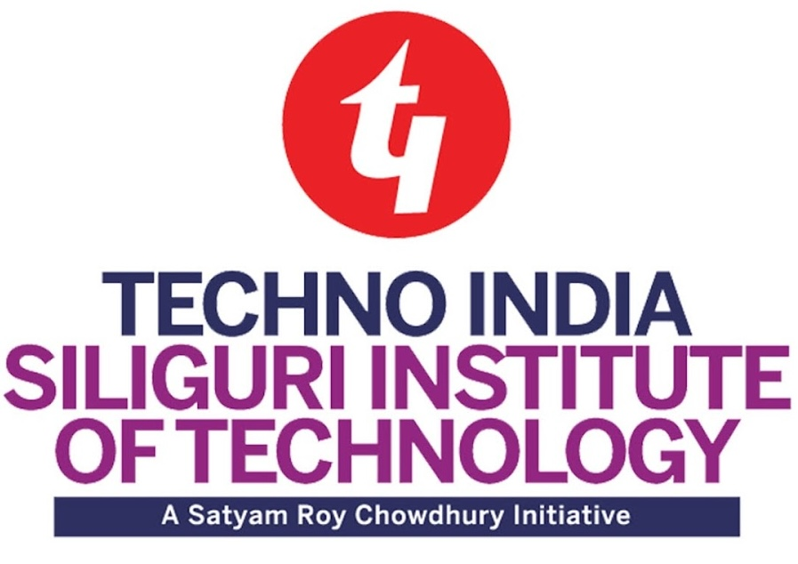

  
I am currently working as the Principal AI Engineer at <a href="https://www.p360.com/">P360</a>, building <a href="https://www.p360.com/edenhelp/">EdenHelp</a> and <a href="https://www.p360.com/birdzai/">BirdzAI</a>. I joined P360 in February 2018 as a founding Data Scientist. As an AI Engineer at P360, I have the fortune of working across diverse areas of machine learning and statistical modelling including natural language understanding, large language model, retrieval-augmented generation for Conversational AI, time series forecasting and optimization techniques, and predictive modelling within the pharmaceutical sector.

  

    

      
      
B.Tech, Computer Science & Eng., <a href="https://sittechno.org/">SIT (MAKAUT)</a>, India Aug. 2014 - Jul. 2018

    

    

    
    
M.Tech, Data Science & Eng., <a href="http://www.bits-pilani.ac.in/">BITS Pilani</a>, India Mar. 2022 - May. 2024

    

    

    
    
Master's Thesis Research Student,<a href="https://www.gla.ac.uk/"> University of Glasgow</a>, UK, Dec. 2023 - Mar. 2024

    

    

      
      
Principal AI Engineer, <a href="https://www.p360.com/">P360</a>, Feb. 2018 - Pres.

    

  
 

  

    My research interest broadly includes <strong>Computer Vision, Vision and Language Modalities, Self-Supervised and Semi-Supervised Learning and Natural Language Understanding.</strong> I also work in deep learning for Medical Image Analysis. Previously, I have worked on document image enhancement.
  
 

  
<strong><em><u>Note - I am actively seeking a full time PhD position in Computer Vision and Deep Learning!</u></em></strong>

  <h3>Updates</h3>
  <ul class="updates-list">
    <li><strong>[May. 2024]</strong> Graduated with an M.Tech in Data Science and Engineering from <a href="https://www.bits-pilani.ac.in/">BITS Pilani</a>!</li>
    <li><strong>[Apr. 2024]</strong> Promoted from Tech Lead to Principal AI Engineer at <a href="https://www.p360.com/leadership/">P360</a>. Excited for the new role!</li>
    <li><strong>[Mar. 2024]</strong> Successfully defended my <a href="https://arxiv.org/pdf/2406.03173">Master's Thesis</a>.</li>
    <li><strong>[Dec. 2023]</strong> The preprint of our paper, <a href="https://arxiv.org/abs/2312.03568">DocBinFormer: A Two-Level Transformer Network for Effective Document Image Binarization</a>, is now available on arXiv.</li>
    <li><strong>[Dec. 2023]</strong> The preprint of our paper, <a href="https://arxiv.org/abs/2312.03946">A Layer-Wise Tokens-to-Token Transformer Network for Improved Historical Document Image Enhancement</a>, is now available on arXiv.</li>
    <li><strong>[Nov. 2023]</strong> Got accepted as a master's thesis student at the School of Computing Science, University of Glasgow.</li>
    <li><strong>[Oct. 2023]</strong> Paper titled <a href="https://dl.acm.org/doi/abs/10.1145/3627631.3627639">TransDocUNet: A Transformer-based UNet Architecture for Degraded Document Image Binarization</a> got accepted at <a href="https://www.iitrpr.ac.in/ICVGIP/">ICVGIP 2023</a> (Core Rank-B).</li>
    <li><strong>[Aug. 2023]</strong> The preprint of our paper, <a href="https://arxiv.org/abs/2308.06623">Polyp-SAM++: Can A Text Guided SAM Perform Better for Polyp Segmentation?</a>, is now available on arXiv.</li>
    <li><strong>[Feb. 2023]</strong> Honored to receive the <a href="https://www.linkedin.com/posts/activity-7031705908409712641-huup?utm_source=share&utm_medium=member_desktop">Citizenship Award</a> from P360 in recognition of my 5 years of dedication and contributions!</li>
    <li><strong>[Jan. 2023]</strong> Became a <a href="https://www.kaggle.com/risabbiswas19">Kaggle Discussion Expert</a>, Highest Rank - 745.</li>
    <li><strong>[Dec. 2022]</strong> Completed <a href="https://media.licdn.com/dms/image/C4E22AQ

FMcdBf4hkbhQ/feedshare-shrink_1280/0/1671638780264?e=1724889600&v=beta&t=UMka8JxUr92ku14VrtO9-HkpoSGmGNJtQROIhk9OItk">my first trek</a> ⛰️ to <a href="https://dooars.info/wp-content/uploads/photo-gallery/imported_from_media_libray/18_kanchenzonga_from_tumling.jpg?bwg=1554903620">Tumling, Nepal</a> reaching an altitude of 10,070 ft.</li>
    <li><strong>[Nov. 2022]</strong> Received an Intel ARC A750 GPU through the <a href="https://community.intel.com/t5/Blogs/Products-and-Solutions/Graphics/Apply-to-be-an-Intel-Arc-Innovator/post/1348540">Intel Arc Innovator initiative</a>.</li>
    <li><strong>[Mar. 2022]</strong> Recognised a Thought Leader in Artificial Intelligence by <a href="https://www.linkedin.com/posts/globalaihub_globalaihub-thoughtleader-ai-activity-6909830724439130112-_yog?utm_source=share&utm_medium=member_desktop">Global AI Hub</a>.</li>
    <li><strong>[Mar. 2022]</strong> Started Master's in Data Science and Engineering from BITS, Pilani, India.</li>
  </ul>

  <h3>Contact Me</h3>
  

  <a href="mailto:risabbiswas19@gmail.com">Email 📩</a> 
  <a href="https://www.linkedin.com/in/risab-biswas/">LinkedIn 🙌</a>
  

