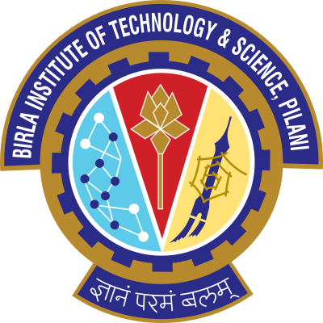

  
I am currently working as the Principal AI Engineer at <a href="https://www.p360.com/" style="color: #2985d8; text-decoration: none;">P360</a>, building <a href="https://www.p360.com/edenhelp/" style="color: #2985d8; text-decoration: none;">EdenHelp</a> and <a href="https://www.p360.com/birdzai/" style="color: #2985d8; text-decoration: none;">BirdzAI</a>. I joined P360 in February 2018 as a founding Data Scientist. As an AI Engineer at P360, I have the fortune of working across diverse areas of Machine Learning and Statistical Modelling including Natural Language Processing, LLMs, Retrieval-Augmented Generation for Conversational AI, Time Series Forecasting, Optimization techniques, and Predictive modelling within the healthcare industry.

  

    

      
      
B.Tech, Computer Science & Eng., <a href="https://sittechno.org/" style="color: #2985d8; text-decoration: none;">SIT (MAKAUT)</a>, India Aug. 2014 - Jul. 2018

    

    

    
    
M.Tech, Data Science & Eng., <a href="http://www.bits-pilani.ac.in/" style="color: #2985d8; text-decoration: none;">BITS Pilani</a>, India Mar. 2022 - May. 2024

    

    

    
    
Master's Thesis Research Student,<a href="https://www.gla.ac.uk/" style="color: #2985d8; text-decoration: none;"> University of Glasgow</a>, UK, Dec. 2023 - Mar. 2024

    

    

      
      
Principal AI Engineer, <a href="https://www.p360.com/" style="color: #2985d8; text-decoration: none;">P360</a>, Feb. 2018 - Pres.

    

  
 

  <!-- 

      My research interest broadly includes <strong>Computer Vision, Vision and Language Modalities, Self-Supervised and Semi-Supervised Learning and Natural Language Understanding.</strong> During my master's I worked on multiple research projects on effective and efficient document image enhancement with <a href="https://scholar.google.com/citations?user=1WVrFGwAAAAJ&hl=en" style="color: #2985d8; text-decoration: none;">Prof. Swalpa Kumar Roy</a>, <a href="https://scholar.google.com/citations?user=2_z_CogAAAAJ&hl=en" style="color: #2985d8; text-decoration: none;">Prof. Umapada Pal</a> and <a href="https://scholar.google.com.sg/citations?user=LhSqQCIAAAAJ&hl=en" style="color: #2985d8; text-decoration: none;">Prof. Guang-Bin Huang</a>. I also worked in Medical Imaging with <a href="https://chaitanya-kaul.github.io/" style="color: #2985d8; text-decoration: none;">Dr. Chaitanya Kaul</a> during my master's thesis. My recent research articles can be found in the <a href="/publications/" style="color: #2985d8; text-decoration: none;">Research</a> section. Please see the <a href="/cv/" style="color: #2985d8; text-decoration: none;">Profile</a> section to know more about my Education, Skills and Experiences.
  
  -->

<h2>Research</h2>

  My research interest broadly includes <strong>Computer Vision, Vision and Language Modalities, Self-Supervised and Semi-Supervised Learning, and Natural Language Understanding.</strong> During my master's, I worked on multiple research projects on effective and efficient document image enhancement with <a href="https://scholar.google.com/citations?user=1WVrFGwAAAAJ&hl=en" style="color: #2985d8; text-decoration: none;">Prof. Swalpa Kumar Roy</a>, <a href="https://scholar.google.com/citations?user=2_z_CogAAAAJ&hl=en" style="color: #2985d8; text-decoration: none;">Prof. Umapada Pal</a>, and <a href="https://scholar.google.com.sg/citations?user=LhSqQCIAAAAJ&hl=en" style="color: #2985d8; text-decoration: none;">Prof. Guang-Bin Huang</a>. I also worked in Medical Imaging with <a href="https://chaitanya-kaul.github.io/" style="color: #2985d8; text-decoration: none;">Dr. Chaitanya Kaul</a> during my master's thesis. My recent research articles can be found in the <a href="/publications/" style="color: #2985d8; text-decoration: none;">Research</a> section. Please see the <a href="/cv/" style="color: #2985d8; text-decoration: none;">Profile</a> section to know more about my Education, Skills, and Experiences.

 

<h2>Academic Services</h2>

  <ul>
    <li>Reviewer for IEEE Transactions on Cybernetics (Oct. '23 - Present)</li>
    <li>Reviewer for Elsevier Journal of Computers in Biology and Medicine (Apr. '24 - Present)</li>
  </ul>

 

  
<strong><em><u>Note - I am actively seeking a full time PhD position in Computer Vision and Deep Learning!</u></em></strong>

  <h3 style="text-decoration: underline;">Updates:</h3>
  <ul class="updates-list">
    <li><strong>[May. 2024]</strong> Graduated with an M.Tech in Data Science and Engineering from <a href="https://www.bits-pilani.ac.in/" style="color: #2985d8; text-decoration: none;">BITS Pilani, India</a>!</li>
    <li><strong>[Apr. 2024]</strong> Promoted from Tech Lead to Principal AI Engineer at <a href="https://www.p360.com/leadership/" style="color: #2985d8; text-decoration: none;">P360</a>. Excited for the new role!</li>
    <li><strong>[Mar. 2024]</strong> Successfully defended my <a href="https://arxiv.org/pdf/2406.03173" style="color: #2985d8; text-decoration: none;">Master's Thesis</a>.</li>
    <li><strong>[Dec. 2023]</strong> The preprint of our paper, <a href="https://arxiv.org/abs/2312.03568" style="color: #2985d8; text-decoration: none;">DocBinFormer: A Two-Level Transformer Network for Effective Document Image Binarization</a>, is now available on arXiv.</li>
    <li><strong>[Dec. 2023]</strong> The preprint of our paper, <a href="https://arxiv.org/abs/2312.03946" style="color: #2985d8; text-decoration: none;">A Layer-Wise Tokens-to-Token Transformer Network for Improved Historical Document Image Enhancement</a>, is now available on arXiv.</li>
    <li><strong>[Nov. 2023]</strong> Got accepted as a master's thesis student at the School of Computing Science, University of Glasgow.</li>
    <li><strong>[Oct. 2023]</strong> Paper titled <a href="https://dl.acm.org/doi/abs/10.1145/3627631.3627639" style="color: #2985d8; text-decoration: none;">TransDocUNet: A Transformer-based UNet Architecture for Degraded Document Image Binarization</a> got accepted at <a href="https://www.iitrpr.ac.in/ICVGIP/" style="color: #2985d8; text-decoration: none;">ICVGIP 2023</a> (Core Rank-B).</li>
    <li><strong>[Aug. 2023]</strong> The preprint of our paper, <a href="https://arxiv.org/abs/2308.06623" style="color: #2985d8; text-decoration: none;">Polyp-SAM++: Can A Text Guided SAM Perform Better for Polyp Segmentation?</a>, is now available on arXiv.</li>
    <li><strong>[Feb. 2023]</strong> Honored to receive the <a href="https://media.licdn.com/dms/image/C4D22AQEdWsHeU2QLJg/feedshare-shrink_1280/0/1676489330264?e=1724889600&v=beta&t=ke4AZbS55zvxJw1KDHGBDuH1uffjvnlMt6cP7mjCNos" style="color: #2985d8; text-decoration: none;">Citizenship Award</a> from P360 in recognition of my 5 years of dedication and contributions!</li>
    <li><strong>[Jan. 2023]</strong> Became a <a href="https://www.kaggle.com/risabbiswas19" style="color: #2985d8; text-decoration: none;">Kaggle Discussion Expert</a>, Highest Rank - 745.</li>
    <li><strong>[Dec. 2022]</strong> Completed <a href="https://media.licdn.com/dms/image/C4E22AQFMcdBf4hkbhQ/feedshare-shrink_1280/0/1671638780264?e=1724889600&v=beta&t=UMka8JxUr92ku14VrtO9-HkpoSGmGNJtQROIhk9OItk" style="color: #2985d8; text-decoration: none;">my first trek</a> ⛰️ to <a href="https://dooars.info/wp-content/uploads/photo-gallery/imported_from_media_libray/18_kanchenzonga_from_tumling.jpg?bwg=1554903620" style="color: #2985d8; text-decoration: none;">Tumling, Nepal</a> reaching an altitude of 10,070 ft.</li>
    <li><strong>[Nov. 2022]</strong> Received an Intel ARC A750 GPU through the <a href="https://community.intel.com/t5/Blogs/Products-and-Solutions/Graphics/Apply-to-be-an-Intel-Arc-Innovator/post/1348540" style="color: #2985d8; text-decoration: none;">Intel Arc Innovator initiative</a>.</li>
    <li><strong>[Mar. 2022]</strong> Recognised a Thought Leader in Artificial Intelligence by <a href="https://www.linkedin.com/posts/globalaihub_globalaihub-thoughtleader-ai-activity-6909830724439130112-_yog?utm_source=share&utm_medium=member_desktop" style="color: #2985d8; text-decoration: none;">Global AI Hub</a>.</li>
    <li><strong>[Mar. 2022]</strong> Started Master's in Data Science and Engineering from BITS, Pilani, India.</li>
  </ul>

  <h3 style="text-decoration: underline;">Contact Me:</h3>
  

  <a href="mailto:risabbiswas19@gmail.com" style="color: #2985d8; text-decoration: none;">Email 📩</a> 
  <a href="https://www.linkedin.com/in/risab-biswas/" style="color: #2985d8; text-decoration: none;">LinkedIn 🙌</a>
  

 

  

