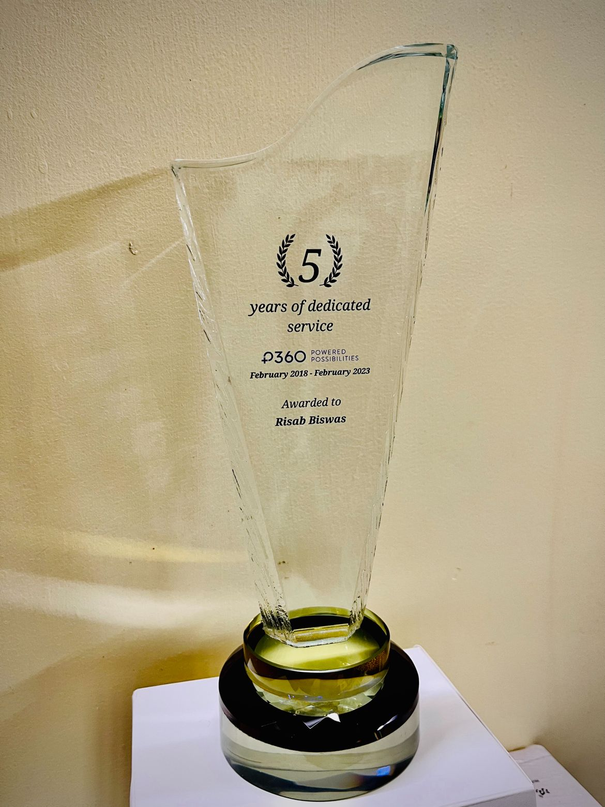
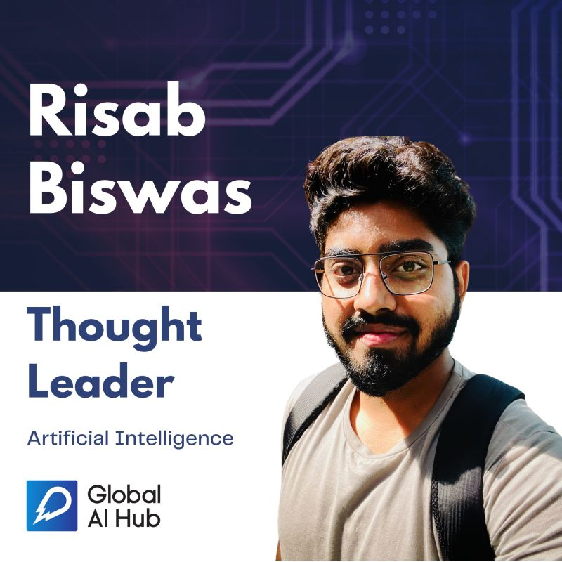
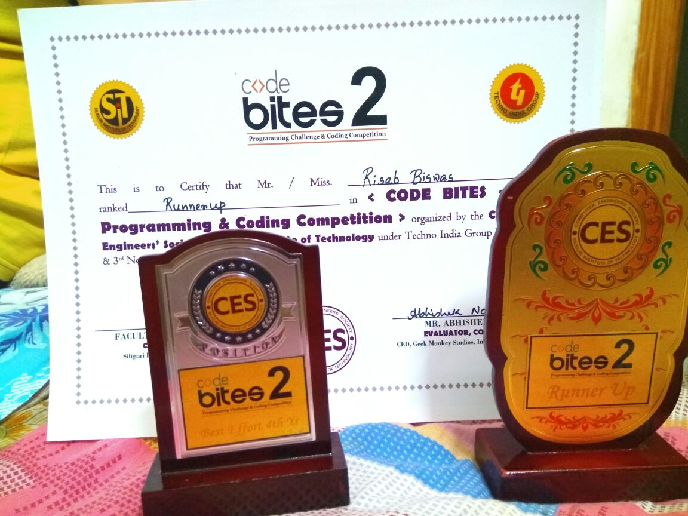

  
  

    <h3>Innovator Excellence Award, Intel, 2019</h3>
    
I was awarded <a href = "https://devmesh.intel.com/posts/638312/congrats-to-our-devmesh-spotlight-award-winners" style="color: #2985d8; text-decoration: none;"> Top Innovator Award</a> in 2019 by Intel, for mu contributions to open source and research in Deep Learning and Comuter Vision.</a>

  
  

    <h3>DevMesh AI Spotlight Award, 2019</h3>
    
Awarded<a href = "https://devmesh.intel.com/posts/638312/congrats-to-our-devmesh-spotlight-award-winners" style="color: #2985d8; text-decoration: none;"> DevMesh AI Spotlight Award</a> in 2019 by Intel, for the project <a href = "Identification of Pathological Disease in Plants" style="color: #2985d8; text-decoration: none;"> Identification of Pathological Disease in Plants.</a>

  
  

    <h3>Top Innovator Award, Intel, 2019</h3>
    
I was awarded <a href = "https://devmesh.intel.com/posts/638312/congrats-to-our-devmesh-spotlight-award-winners" style="color: #2985d8; text-decoration: none;"> Top Innovator Award</a> in 2019 by Intel, for showcasing outstanding innovation and proof of concept development in the field of Artificial Intelligence.</a>

  
  

    <h3>Citizenship Award (5 Years), P360, 2023</h3>
    
Honored to receive the Citizenship Award from <a href = "https://www.p360.com/" style="color: #2985d8; text-decoration: none;">P360</a> in recognition of my 5 years of dedication and contributions!</a>

  
  

    <h3>Thought Leader (Artificial Intelligence), Global AI Hub, 2022</h3>
    
I was recognised a Thought Leader in Artificial Intelligence by <a href = "https://www.linkedin.com/company/globalaihub/" style="color: #2985d8; text-decoration: none;">Global AI Hub </a> in 2019 by Intel, for my research in Deep Learning and Computer Vision.</a>

  
  

    <h3>Dewang Mehta Excellence Award, 2016</h3>
    
Awarded<a href = "https://inspiria.edu.in/inspiria-proud-host-inaugural-dewang-mehta-excellence-award-north-bengal/" style="color: #2985d8; text-decoration: none;"> Dewang Mehta Excellence Award</a> by <a href = "https://en.wikipedia.org/wiki/Krishnakumar_Natarajan" style="color: #2985d8; text-decoration: none;"> Mr. Krishnakumar Natarajan</a>, Co-Founder and Executive Chairman, MindTree, 2016, for outstanding academic performance during my undergraduate studies.

  

  

  

  
  

    <h3>CodeBites2 - Programming and Coding Competition, 2018</h3>
    
Runner-Up and Best Effort Final Year at Code Bites2: Coding Challenge, by <a href = "https://www.sittechno.org/computer-engineer-s-society-computer-science-engineering.html" style="color: #2985d8; text-decoration: none;">Computer Engineers Society, SIT</a> 2018.

  

  

