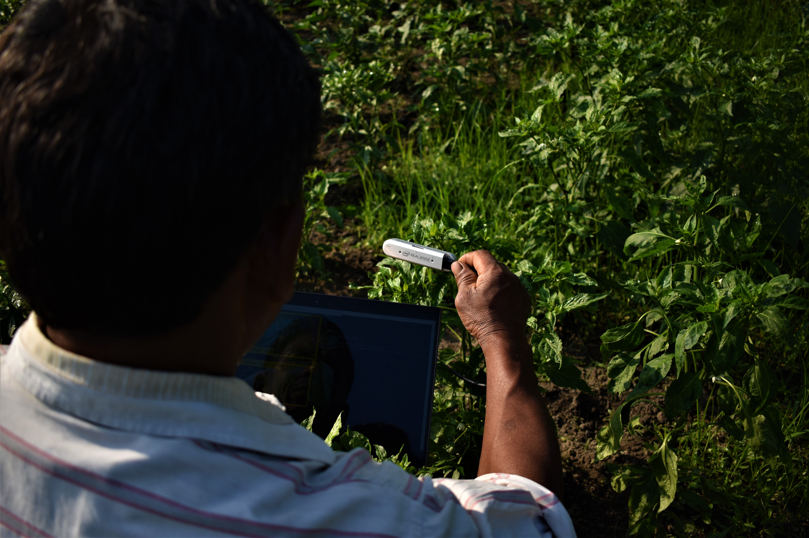

  

    

      
    

    

      <h3>KAUNet: Exploring KAN for Medical Imaging</h3>
      
Description of the project. This can be a detailed paragraph explaining the project, its goals, technologies used, and any other relevant information.

      <a href="LINK_TO_PROJECT">View Project</a>
    

  

  

    

      
    

    

      <h3>SpectraNet</h3>
      
Description of the project. This can be a detailed paragraph explaining the project, its goals, technologies used, and any other relevant information.

      <a href="LINK_TO_PROJECT">View Project</a>
    

  

  

    

      
    

    

      <h3>Krishak Bandu</h3>
      
Description of the project. This can be a detailed paragraph explaining the project, its goals, technologies used, and any other relevant information.

      <a href="LINK_TO_PROJECT">View Project</a>
    

  

  

  

    
  

  

    <h3>Vehicle Advanced Monitoring System (VAMS)</h3>
    
Description of the project. This can be a detailed paragraph explaining the project, its goals, technologies used, and any other relevant information.

    <a href="LINK_TO_PROJECT">View Project</a>
  

  

  

    
  

  

    <h3>Chat-SARCASM</h3>
    
Description of the project. This can be a detailed paragraph explaining the project, its goals, technologies used, and any other relevant information.

    <a href="LINK_TO_PROJECT">View Project</a>
  

  

  

    
  

  

    <h3>Conversational AI With Persona</h3>
    
Description of the project. This can be a detailed paragraph explaining the project, its goals, technologies used, and any other relevant information.

    <a href="LINK_TO_PROJECT">View Project</a>
  

