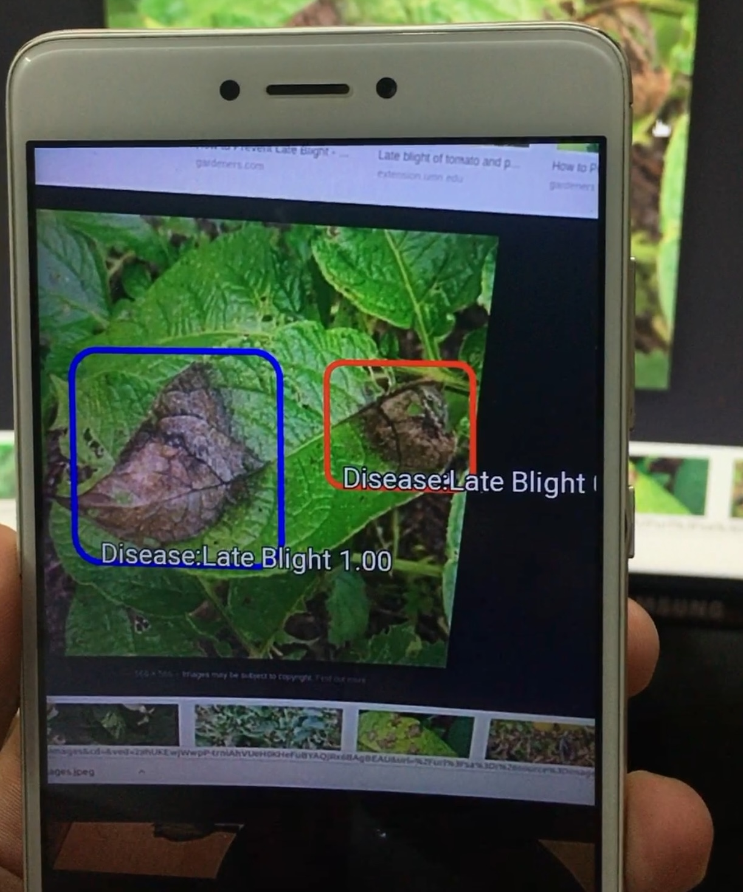

  <!-- 

    

      
    

    

      <h3>KAUNet: Exploring KAN for Medical Imaging</h3>
      
Description of the project. This can be a detailed paragraph explaining the project, its goals, technologies used, and any other relevant information.

      <a href="LINK_TO_PROJECT">View Project</a>
    

  

  

    

      
    

    

      <h3>SpectraNet</h3>
      
Description of the project. This can be a detailed paragraph explaining the project, its goals, technologies used, and any other relevant information.

      <a href="LINK_TO_PROJECT">View Project</a>
    

  
 -->
  

    

      
    

    

      <h3>Krishak Bandhu</h3>
      
In 2019, I developed Krishak Bandhu, an innovative mobile application designed to help farmers in India detect plant diseases using deep learning. While numerous techniques for plant disease detection exist, my goal was to create a solution that was both simple and cost-effective for the agricultural community. Krishak Bandhu stands out for its user-friendly interface, making advanced plant health monitoring accessible and practical for farmers across the country.

      <a href="LINK_TO_PROJECT" style="color: blue; text-decoration: none;">[Project]</a> 
      <a href="LINK_TO_PROJECT" style="color: blue; text-decoration: none;">[Demo]</a>
    

  

  

  

    
  

  

    <h3>Vehicle Advanced Monitoring System (VAMS)</h3>
    
Description of the project. This can be a detailed paragraph explaining the project, its goals, technologies used, and any other relevant information.

    <a href="LINK_TO_PROJECT">View Project</a>
  

  

  

    
  

  

    <h3>Chat-SARCASM</h3>
    
Description of the project. This can be a detailed paragraph explaining the project, its goals, technologies used, and any other relevant information.

    <a href="LINK_TO_PROJECT">View Project</a>
  

  

  

    
  

  

    <h3>Conversational AI With Persona</h3>
    
Description of the project. This can be a detailed paragraph explaining the project, its goals, technologies used, and any other relevant information.

    <a href="LINK_TO_PROJECT">View Project</a>
  

