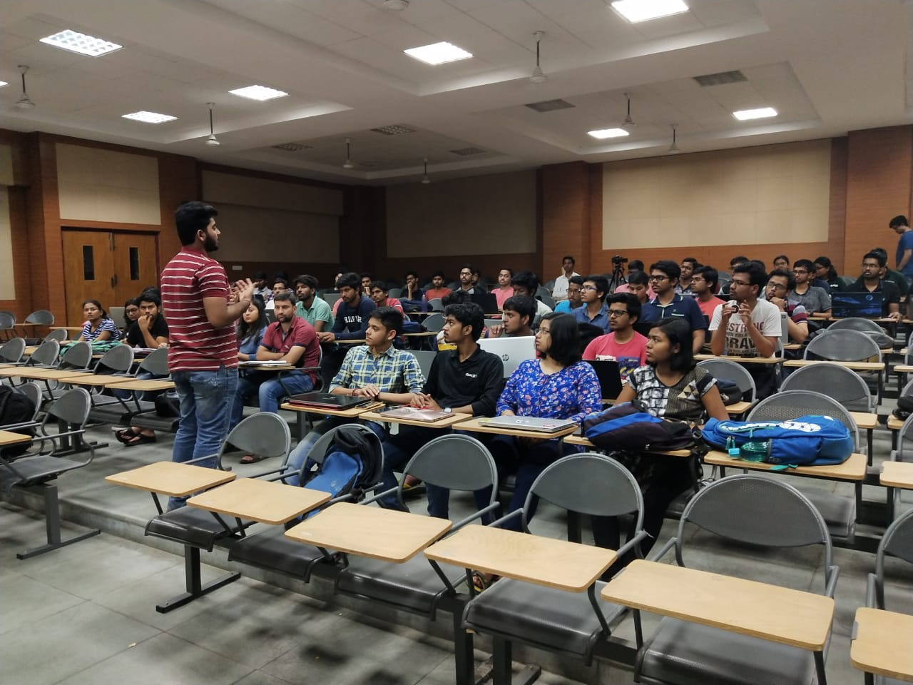
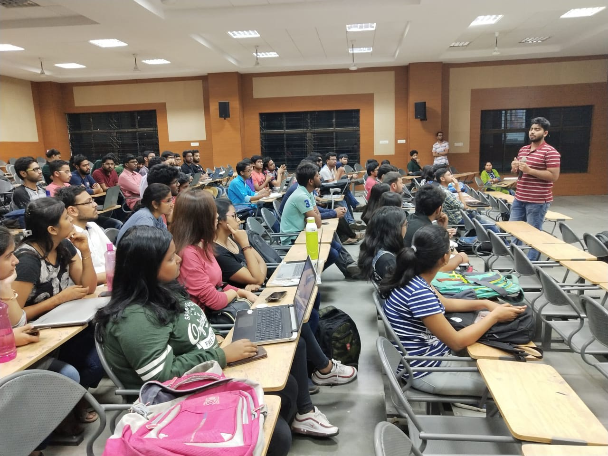
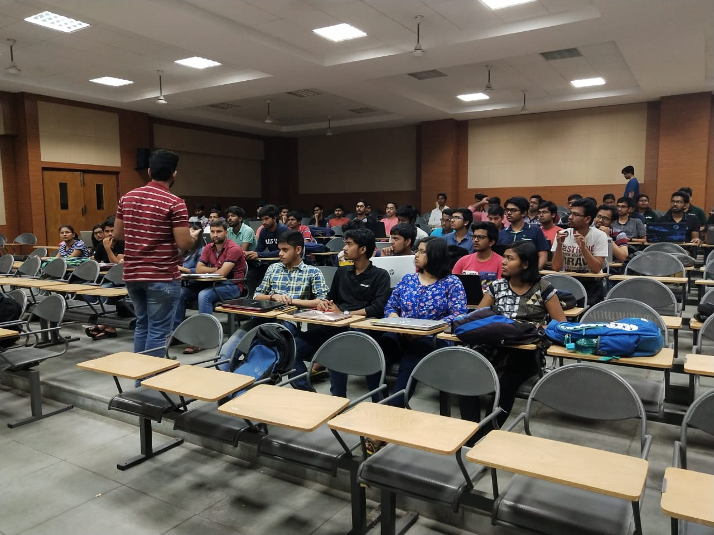

## Talks

  

    
    

      <h3>Title of Talk 1</h3>
      
<strong>Date:</strong> January 1, 2023

      
A brief description of Talk 1. Discuss the key points, audience, and any notable outcomes.

    

  

  

    
    

      <h3>Title of Talk 2</h3>
      
<strong>Date:</strong> February 15, 2023

      
A brief description of Talk 2. Discuss the key points, audience, and any notable outcomes.

    

  

  

    
    

      <h3>Title of Talk 3</h3>
      
<strong>Date:</strong> March 30, 2023

      
A brief description of Talk 3. Discuss the key points, audience, and any notable outcomes.

    

  

