
I enjoy sharing my experiences and insights gained from exploring the fields of machine learning and computer vision. I love discussing the projects I've worked on, the challenges I've faced, and the solutions I've discovered. Teaching undergraduate and graduate students about computer vision concepts is a passion of mine, and it's something I could do for the rest of my life that is learning, experimenting, and teaching. Here are a few talks I've given at community meetups, conferences, and larger events, where I've had the pleasure of discussing my journey and helping others learn something new.

  

  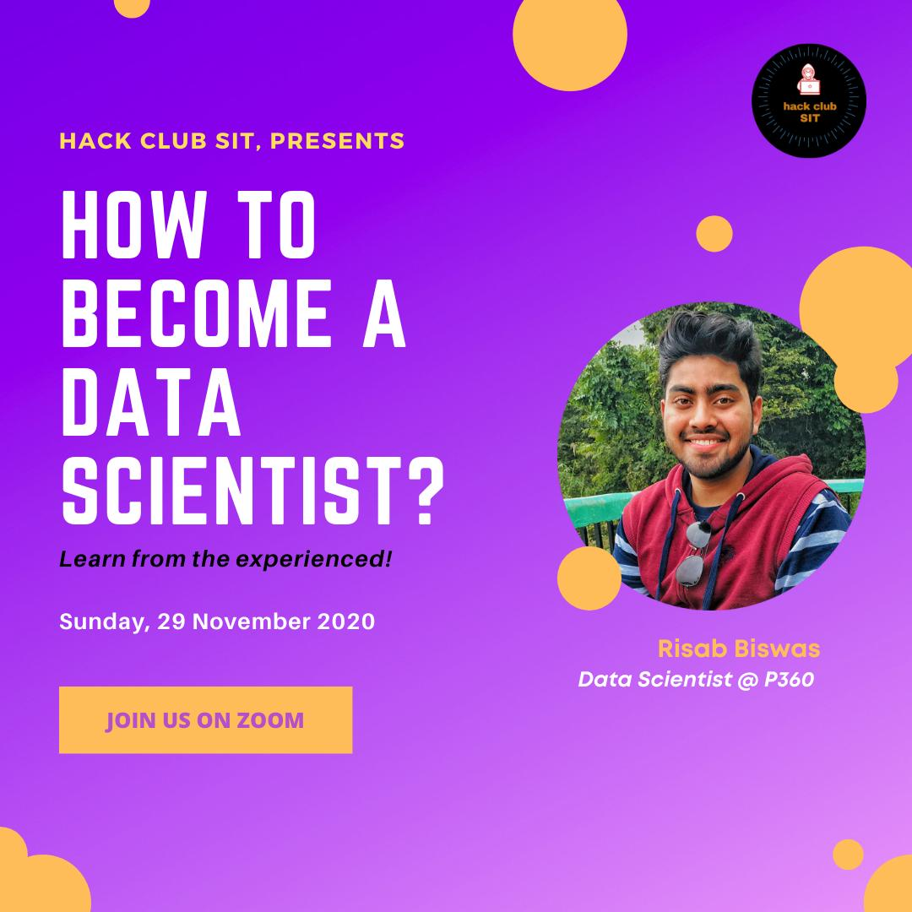
  

    <h3>How to become a Data Scientist?</h3>
    
<strong>Date:</strong> Nov. 29, 2020

    
I was invited to share my journey and guide undergradute students on how to build a career as a Machine Learning Engineer/Data Scientist,<a href = "https://hackclub.com/" style="color: #2985d8; text-decoration: none;"> organized by Hack Club</a>.

  

  

  

  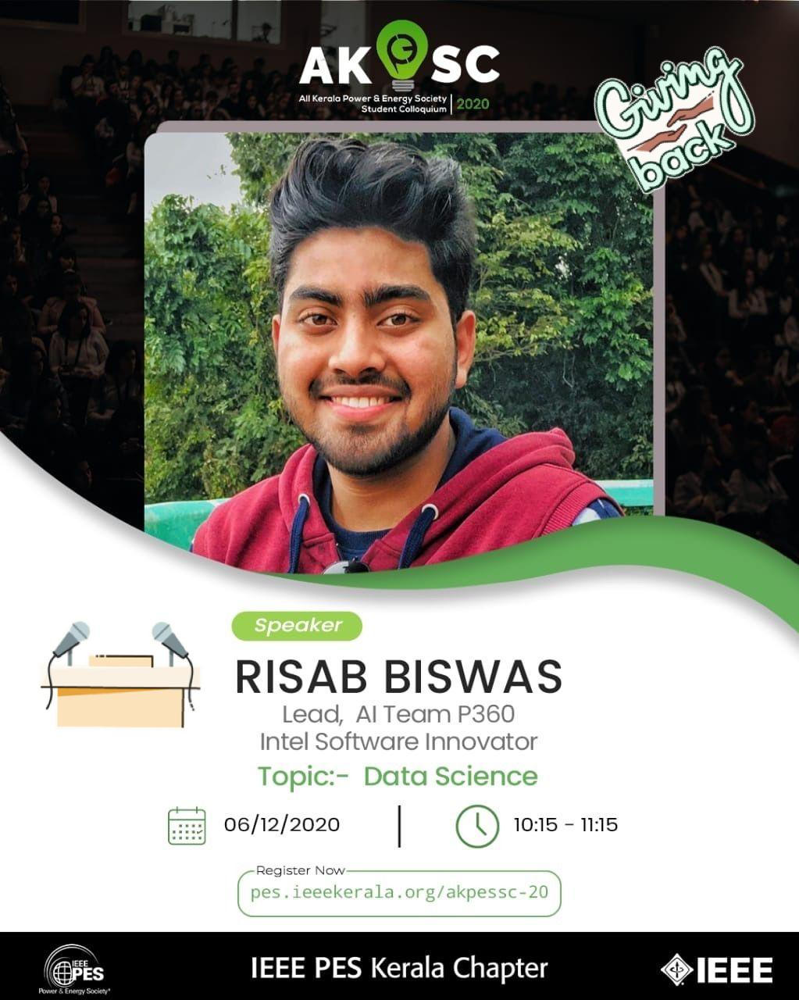
  

    <h3>Advancements in Data Science and Machine Learning, AKPESSC'20</h3>
    
<strong>Date:</strong> Nov. 29, 2020

    
I was invited to take a session on the rapidly evolving fields of Data Science and Machine Learning, organized by <a href = "https://pes.ieeekerala.org/akpessc-20/" style="color: #2985d8; text-decoration: none;">All Kerala Power & Energy Society Students Colloquium (AKPESSC)</a>, flag-ship event organized by the <a href = "https://pes.ieeekerala.org/" style="color: #2985d8; text-decoration: none;">IEEE PES Kerala Chapter</a>.

  

  

  

  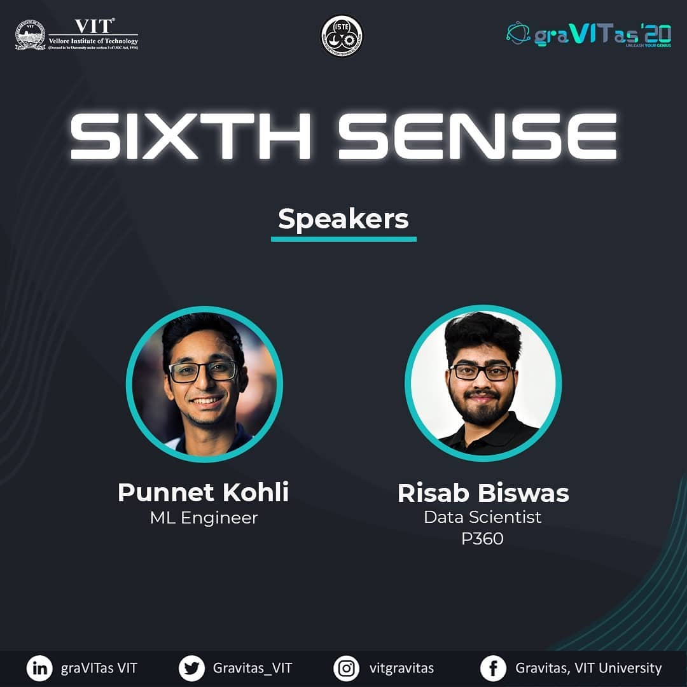
  

    <h3>Guest Speaker at Gravitas'20, VIT University</h3>
    
<strong>Date:</strong> Sep. 26, 2020

    
I was invited to speak at <a href = "https://vit.ac.in/general/gravitas-2020" style="color: #2985d8; text-decoration: none;">Gravitas 2020</a>, the Annual Tech Fest of <a href = "https://vit.ac.in/" style="color: #2985d8; text-decoration: none;">VIT University</a>. Gave a talk on "Advancements and Applications of Deep Learning in Computer Vision". I covered topics in Convolutional Neural Networks and Object Detection with practical applications in real-time edge inference, while also addressing ethical considerations and model optimization techniques.

  

  

  

  
  

    <h3>Paper Presentation at ICAN 2020</h3>
    
<strong>Date:</strong> Feb. 14, 2020

    
Presented our research paper at <a href = "https://ieeexplore.ieee.org/xpl/conhome/9169738/proceeding" style="color: #2985d8; text-decoration: none;">ICAN 2020</a> at <a href = "https://www.chitkara.edu.in/events/indo-taiwan-ican-2020/" style="color: #2985d8; text-decoration: none;">Chitkara University</a>.

  

  

  

  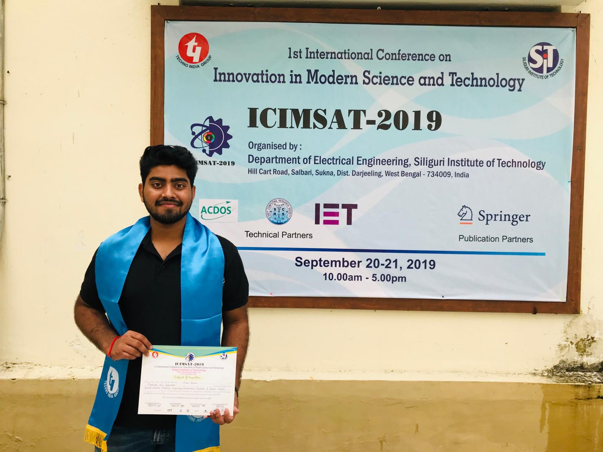
  

    <h3>Paper Presentation at ICISMAST 2019</h3>
    
<strong>Date:</strong> Sep. 20, 2019

    
Presented our paper at <a href = "https://link.springer.com/book/10.1007/978-3-030-42363-6" style="color: #2985d8; text-decoration: none;">ICIMSAT 2019</a>, First International Conference on Innovations in Modern Science and Technology (ICIMSAT2019), held in Siliguri, India. 
 

  

  

  

  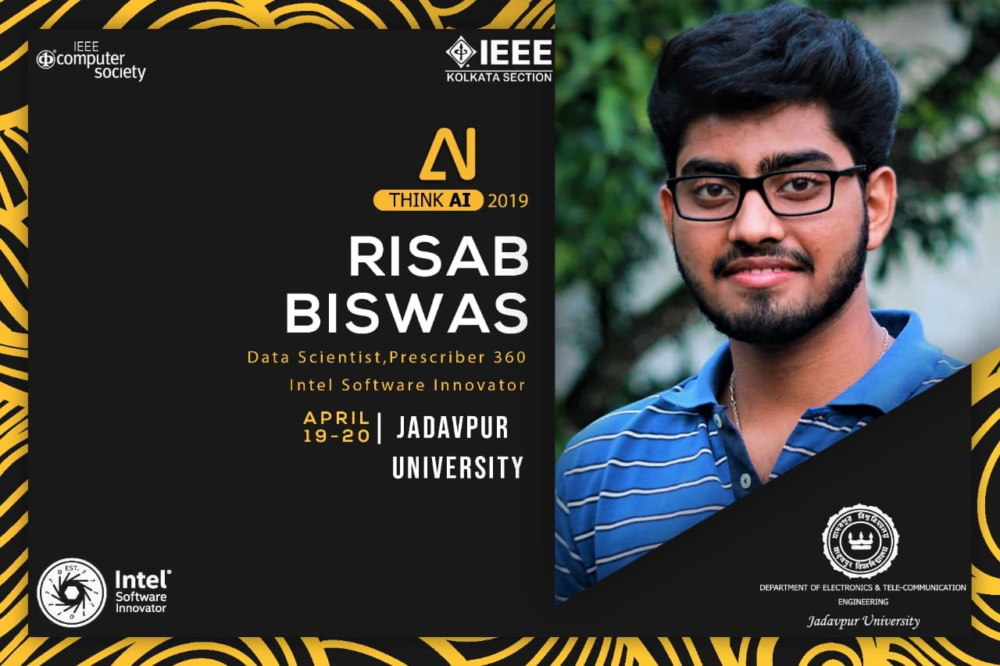
  

    <h3>Invited Speaker at IEEE Machine Learning Summit'19</h3>
    
<strong>Date:</strong> Apr. 19, 2019

    
I was honoured to be invited as a guest speaker at <a href = "https://ieee-ju.github.io/thinkai/index.html#" style="color: #2985d8; text-decoration: none;">ThinkAI</a> organized by <a href = "https://www.ieee-jaduniv.in/" style="color: #2985d8; text-decoration: none;">IEEE Student Chapter</a> at <a href = "https://jadavpuruniversity.in/" style="color: #2985d8; text-decoration: none;">Jadavpur University</a>. My topic of discussion was deep learning, computer vision and performing faster inference on low compute devices.

  

  

  

  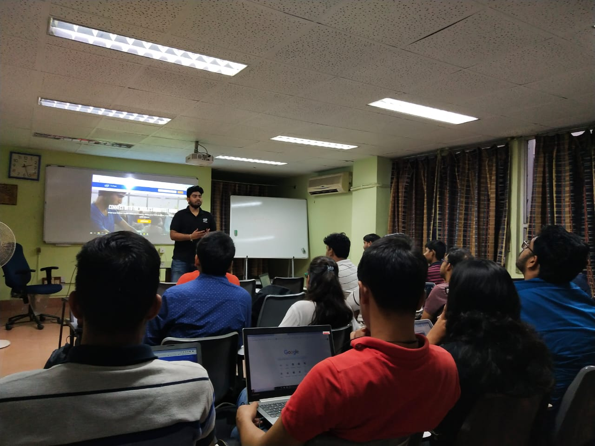
  

    <h3>Lecture at Sixth Summer School on Computer Vision, Graphics and Image Processing at ISI, Kolkata</h3>
    
<strong>Date:</strong> Jun. 17, 2019

    
I was invited as a guest lecturer at the <a href = "https://www.isical.ac.in/~ecsu/?q=node/87" style="color: #2985d8; text-decoration: none;">Sixth Summer School on Computer Vision, Graphics and Image Processing</a> at the ECSU, <a href = "https://www.isical.ac.in/" style="color: #2985d8; text-decoration: none;">Indian Statistical Institute, Kolkata</a>. I delivered a lecture "Latest Trends in Deep Learning and Computer Vision and their Real-World Applications".

  

  

  

  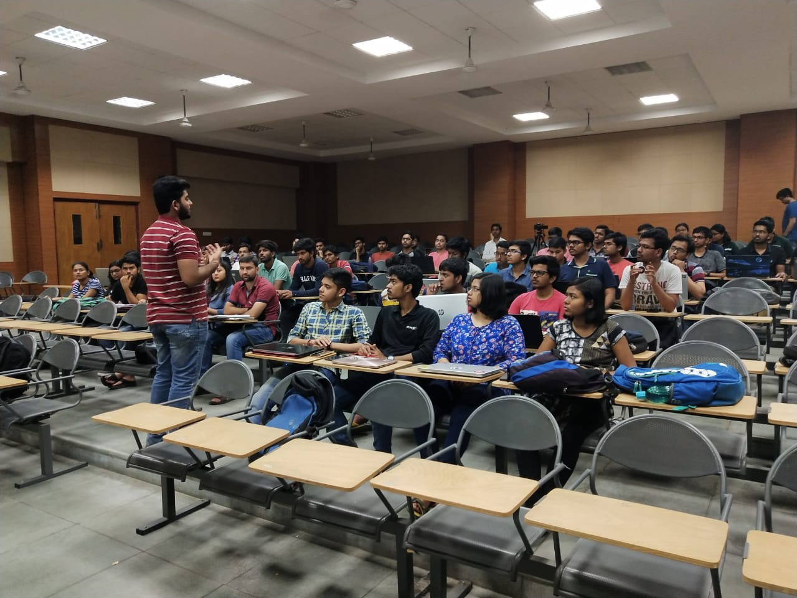
  

    <h3>AI Meetup and Project Demonstartion at NIT, Durgapur</h3>
    
<strong>Date:</strong> Mar. 14, 2018

    
I had the opportunity to present and discuss my plant disease detection project and talk about computer vision at the <a href="https://nitdgp.ac.in/" style="color: #2985d8; text-decoration: none;">National Institute of Technology (NIT), Durgapur</a>, where I showcased my project and discussed recent advancements in computer vision. The event was a vibrant platform for exchanging ideas and showcasing cutting-edge solutions.

  

  

  

  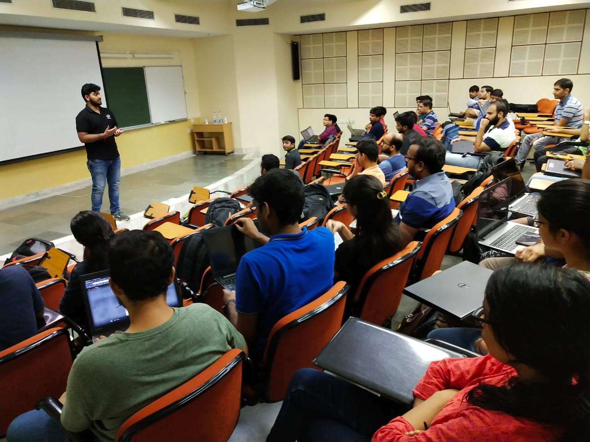
  

    <h3>Deep Learning and Computer Vision on Edge Devices at IIT Kanpur, India</h3>
    
<strong>Date:</strong> Sep. 17, 2019

    
Invited as a guest lecturer at the <a href = "https://www.cse.iitk.ac.in/" style="color: #2985d8; text-decoration: none;">Dept. of Computer Science and Eng.</a> at the <a href = "https://www.iitk.ac.in/" style="color: #2985d8; text-decoration: none;">Indian Institute of Technology Kanpur (IIT-K), India</a>. I delivered a lecture on "Deep Learning and Computer Vision on Edge Devices" to graduate and undergraduate students.

  

  

  

  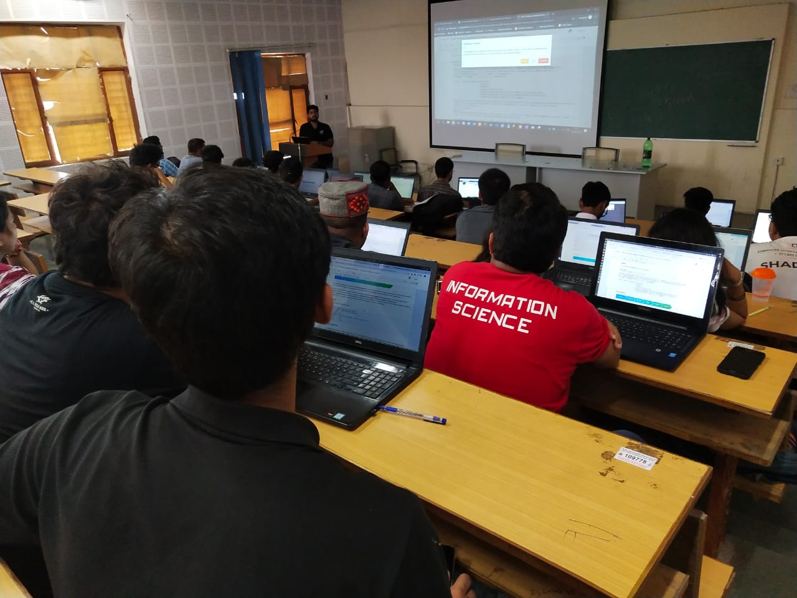
  

    <h3>Introduction to Edge Deployment for Computer Vision Models at IIT BHU, India</h3>
    
<strong>Date:</strong> Sep. 22, 2019

    
One day seminar at the <a href = "https://www.iitbhu.ac.in/dept/cse" style="color: #2985d8; text-decoration: none;">Dept. of Computer Science and Eng.</a> at the <a href = "https://www.iitbhu.ac.in/" style="color: #2985d8; text-decoration: none;">Indian Institute of Technology (BHU), India</a>. The session covered how to deploy and do real-time inference on edge devices. I discussed an overview of edge computing and its benefits for CV applications, challenges of deploying CV models on edge devices, including computational and memory constraints.

  

  

  

  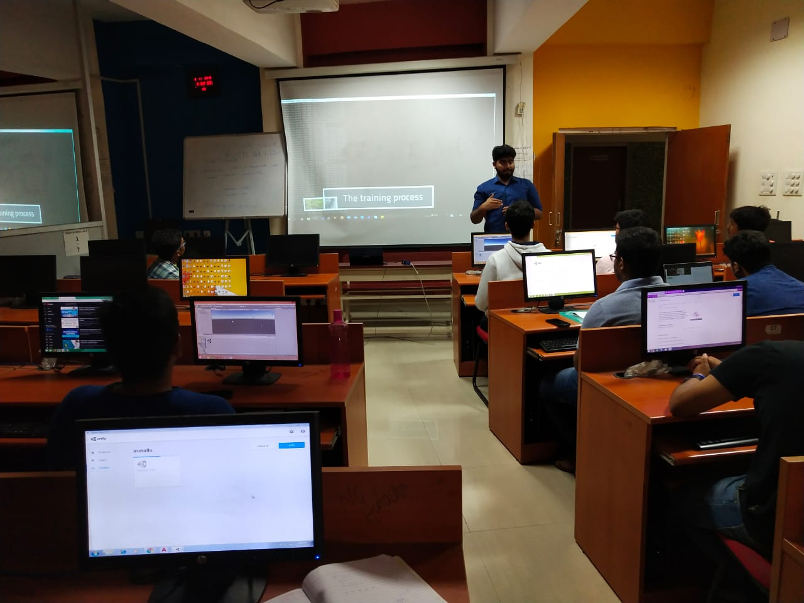
  

    <h3>Real-Time Object Detection with Edge Inference at NIT Rourkela, India</h3>
    
<strong>Date:</strong> Nov. 3, 2019

    
I was invited to give a talk during Innovision (Annual Technical Fest) 2019, at the <a href = "https://www.nitrkl.ac.in/" style="color: #2985d8; text-decoration: none;">National Institute of Technology (NIT), Rourkela</a>. Discussed applications in agriculture and showcased my plant disease detection project. Also discussed benefits of edge inference for low-latency and privacy-preserving applications. The participants included Developers, Students and Research Scholars. 

  

  

  

    
    

      <h3>Introduction to Machine Learning Algorithms</h3>
      
<strong>Date:</strong> Aug. 1, 2018

      
Gave a one day talk on "Introduction to Machine Learning" at the Department of Computer Science, <a href="https://www.sittechno.org" style="color: #2985d8; text-decoration: none;">Siliguri Institute of Technology</a>. Covered theoretical concepts on Supervised Learning, Regression Algorithms, Classification Algorithms, Unsupervised Modelling, followed by a hands on session using Python.

    

  

  

    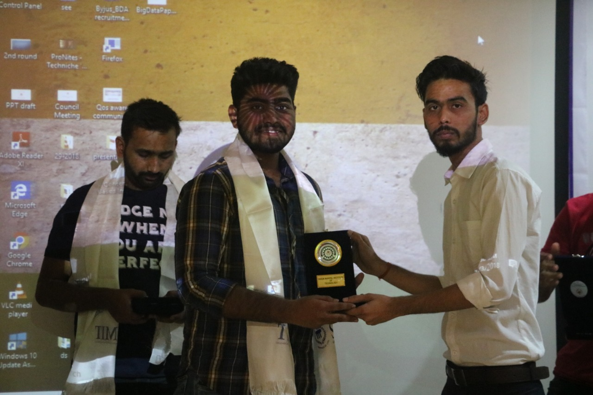
    

      <h3>AI on Cloud and Edge Devices</h3>
      
<strong>Date:</strong> Nov. 12, 2018

      
I was invited as a guest speaker to deliver a talk on "AI on Cloud and Edge Devices" at <a href="https://smu.edu.in/smit.html/" style="color: #2985d8; text-decoration: none;">Sikkim Manipal Institute of Technology (SMIT)</a>, India.

    

  

  

    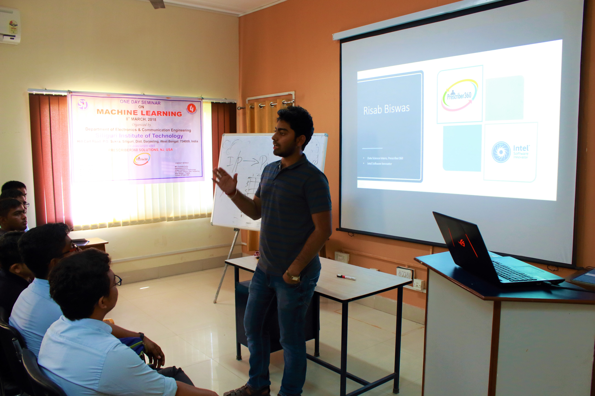
    

      <h3>One Day Seminar on Machine Learning</h3>
      
<strong>Date:</strong> Mar. 8, 2018

      
My first seminar, given to the undergradute students at the <a href="https://www.sittechno.org/electronics-communication-engineering-engineering-technology.html" style="color: #2985d8; text-decoration: none;">Department of Electronics and Communication Eng., Siliguri Institute of Technology</a> on "Introduction to Machine Learning". First Session was more on Understanding and Getting used to the Things that included setting up the environments. Second Session was Hands on Demo followed by Discussion and QnA.

    

  

  

    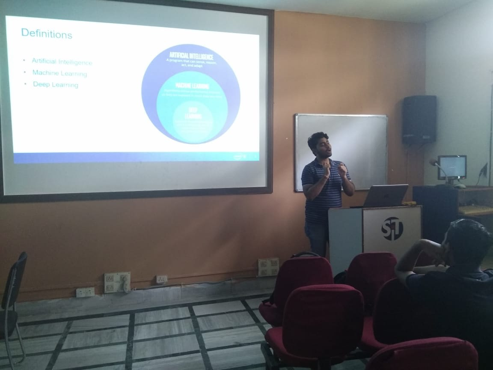
    

      <h3>Introduction to AI/ML</h3>
      
<strong>Date:</strong> Aug. 28, 2018

      
I was invited as a guest speaker on "Introduction to AI/ML" at the <a href="https://www.sittechno.org/information-technology-engineering-technology.html" style="color: #2985d8; text-decoration: none;">Department of Information Technology, Siliguri Institute of Technology</a>. Topics covered were AI, Machine Learning, Computer Vision and Object Detection.

    

  

  

    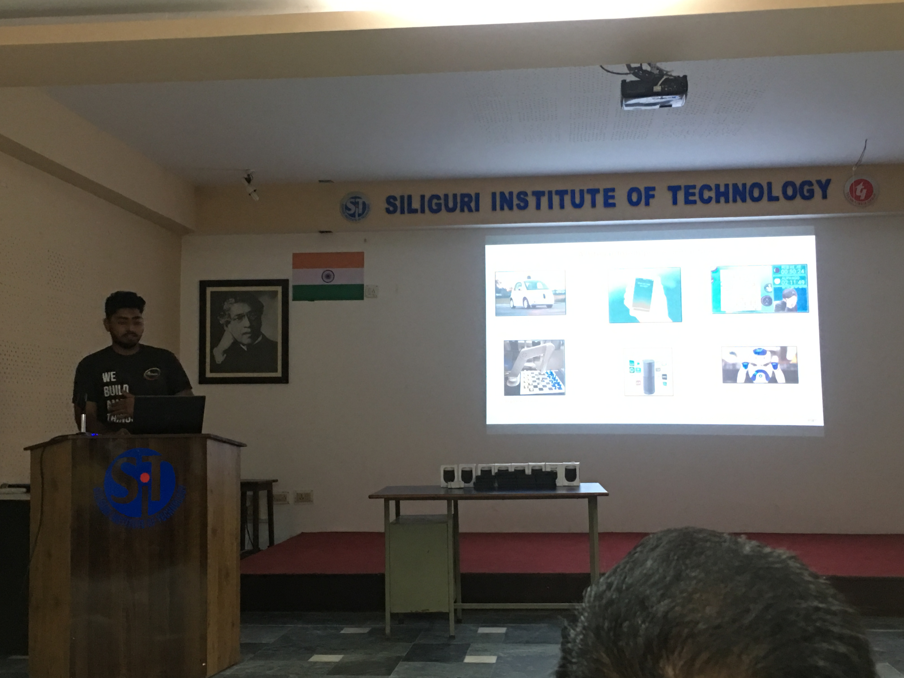
    

      <h3>Introduction to Deep Learning and Computer Vision for Robotics</h3>
      
<strong>Date:</strong> Nov. 5, 2018

      
I was invited as a guest speaker for taking a session on "Deep Learning and Computer Vision for Robotics" at <a href="https://www.sittechno.org" style="color: #2985d8; text-decoration: none;">Siliguri Institute of Technology</a>

    

  

  

  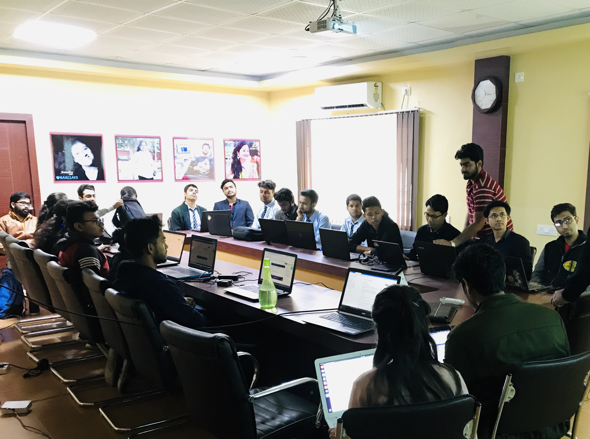
  

    <h3>Hands on Workshop on Computer Vision and Intel OpenVino Toolkit</h3>
    
<strong>Date:</strong> May. 25, 2019

    
I had the opportunity to conduct a hands on workshop on performing faster inference for computer vision applications using Intel Distribution of the OpenVino Toolkit. The event was organized in collaboration with GDG Siliguri.

  

  

  

  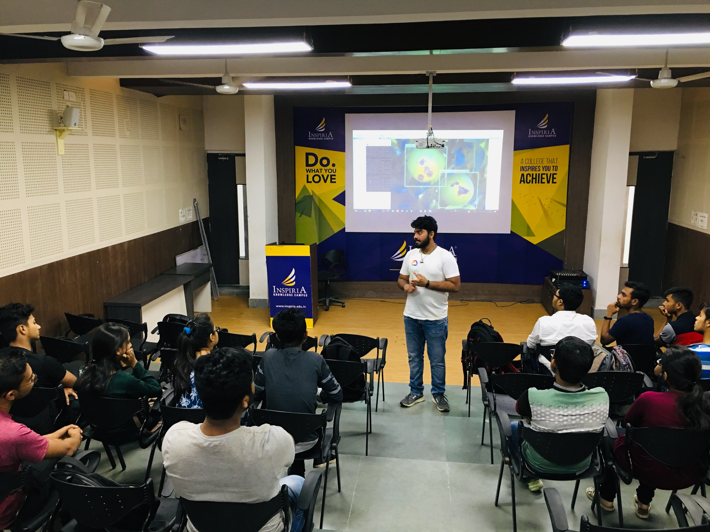
  

    <h3>Optimizing Computer Vision Applications using Intel® Distribution of OpenVINO Toolkit</h3>
    
<strong>Date:</strong> May. 25, 2019

    
I was invited as a guest speaker by <a href = "https://gdg.community.dev/gdg-siliguri/" style="color: #2985d8; text-decoration: none;">GDG Siliguri</a>. I had the chance to discuss how to train custom object detection model's using Tensorflow and showcased my projects at <a href = "https://inspiria.edu.in/" style="color: #2985d8; text-decoration: none;">Inspiria Knowledge Campus</a>.

  

  

